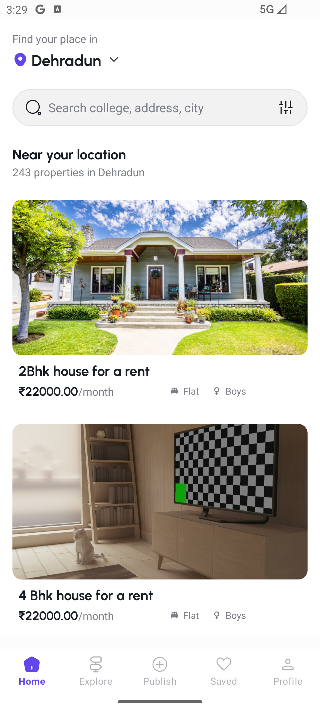
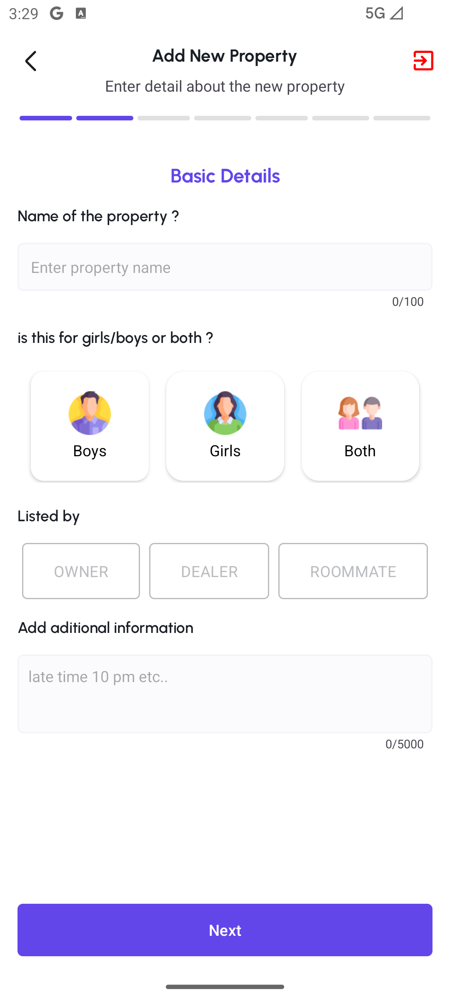
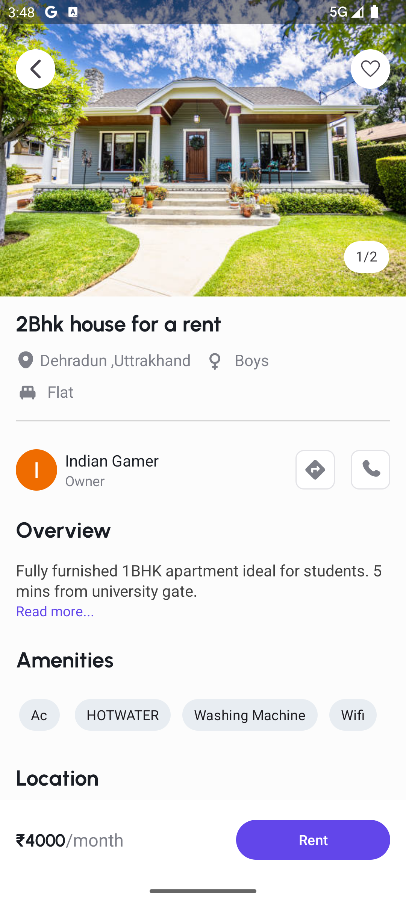
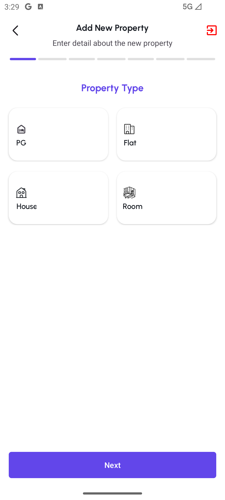

# 🏫 Campus_Rent - University Accommodation Finder App

**Campus_Rent** is an Android application designed to help university students find suitable accommodations near their campus with ease. Users can search, filter, view detailed listings, contact landlords, and even save favorite rooms.

---

## ✨ Features

- 🔍 Search and filter listings by location, price, and preferences
- 🏠 View detailed accommodation information (photos, rent, address, etc.)
- 💬 Contact landlords directly through the app
- ❤️ Save listings as favorites for quick access
- 🧭 Clean, student-friendly UI with modern Android development practices

---

## 📸 Screenshots

  
  
  
  

## 🛠️ Built With

- **Kotlin** – Modern, expressive Android language
- **MVVM Architecture** – Clean separation of concerns
- **Retrofit** – Networking and REST API integration
- **Dagger-Hilt** – Dependency injection
- **Jetpack Components** – Lifecycle-aware components (ViewModel, LiveData)
- **Material Design** – Beautiful UI elements
- **Firebase** – For Authentication Support
- **Google Map Api** - For Maps Used

